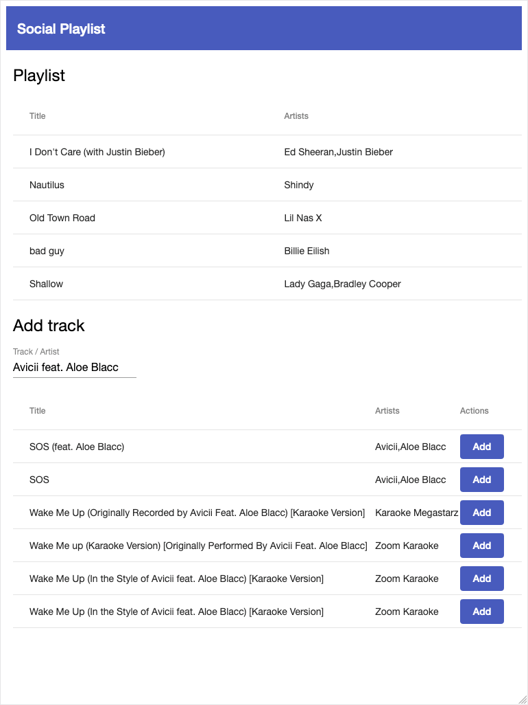

# Building a Web Application with Spring Boot and Angular 

_by [Etienne Fux](http://github.com/efux) and [Lukas Akermann](https://github.com/lakermann)_

Course material for the "Building a Web Application with Spring Boot and Angular" Workshop.

* <https://lakermann.github.io/social-playlist>

