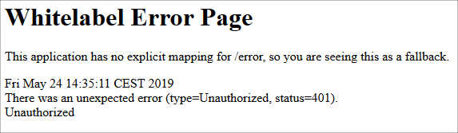

# Automatic login on first page visit

Everytime we restart the application we have to call the [/api/login](https://localhost:8080/api/login) endpoint, to set the token on the backend.
It would be better, if the user gets redirected to the login page, if the application has not received a valid token yet.
We are going to see in this chapter, how this could be done.

## Backend

First we have to find out what happens, if the user has no token yet.
If we want to access the [/api/playlists/tracks](https://localhost:8080/api/playlists/tracks) endpoint without getting a token first, we receive an empty result back and in the console output of the application we can see `Error: Invalid access token`.
We can easily find out, that the error stems from the `try`/`catch`-block in the method `getTracksOfPlaylist` from the `SpotifyClient` class.

We want to change this behaviour and instead return the status code 401, which stands for `UNAUTHORIZED`.
For this, we first create a new exception type `NotLoggedInException` and tell it with the `@ResponseStatus` annotation, that it should be mapped to the HTTP status code 401.

```java
@ResponseStatus(value = HttpStatus.UNAUTHORIZED)
public class NotLoggedInException extends RuntimeException {
    public NotLoggedInException(UnauthorizedException e) {
        super("Unauthorized", e);
    }
}
```

For throwing this exception, we add another `catch`-block in the `getTracksOfPlaylist`, which catches the exception from the wrapper API and maps it to the newly created `NotLoggedInException`. 

```java{11,12}
@Override
public List<Track> getTracksOfPlaylist(String playlistId) {
    GetPlaylistsTracksRequest getPlaylistRequest = spotifyApi.getPlaylistsTracks(playlistId).build();

    try {
        Paging<PlaylistTrack> paging = getPlaylistRequest.execute();
        return Arrays.stream(paging.getItems())
                .map(PlaylistTrack::getTrack)
                .map(SpotifyClient::map)g
                .collect(toList());
    } catch(UnauthorizedException e) {
        throw new NotLoggedInException(e);
    } catch(IOException | SpotifyWebApiException e) {
        System.err.println("Error: " + e.getMessage());
    }
    return emptyList();
}
```

If you restart the application now and then try to access the the [/api/playlists/tracks](https://localhost:8080/api/playlists/tracks) endpoint you should not see the same error as before on the console and the HTTP status code of the request should be 401:




## Frontend

We will create an interceptor that redirects HTTP 401 API errors to the spotifiy login page.

1. Open a console terminal and issue the following command.

     ```bash
    ng generate class unauthorized-interceptor
    ```

2. Add a redirection to the login API if an 401 error occurs.

    ```typescript
    import {HttpErrorResponse, HttpEvent, HttpHandler, HttpInterceptor, HttpRequest} from '@angular/common/http';
    import {Observable, throwError} from 'rxjs';
    import {catchError} from 'rxjs/operators';
    import {Injectable} from '@angular/core';

    @Injectable()
    export class UnauthorizedInterceptor implements HttpInterceptor {

      intercept(req: HttpRequest<any>, next: HttpHandler): Observable<HttpEvent<any>> {
        return next.handle(req).pipe(
          catchError((err: HttpErrorResponse) => {
            if (err.status === 401) {
              window.location.href = '/api/login';
            }
            return throwError(err);
          })
        );
      }
    }
    ```

3. Next, we need to edit the `app.module.ts` file, so Angular uses the interceptor.
  
  ```typescript{2}
  providers: [
      {provide: HTTP_INTERCEPTORS, useClass: UnauthorizedInterceptor, multi: true}
    ],
  ```

::: tip EXERCISE

* Push your changes to Heroku and test the application.

:::