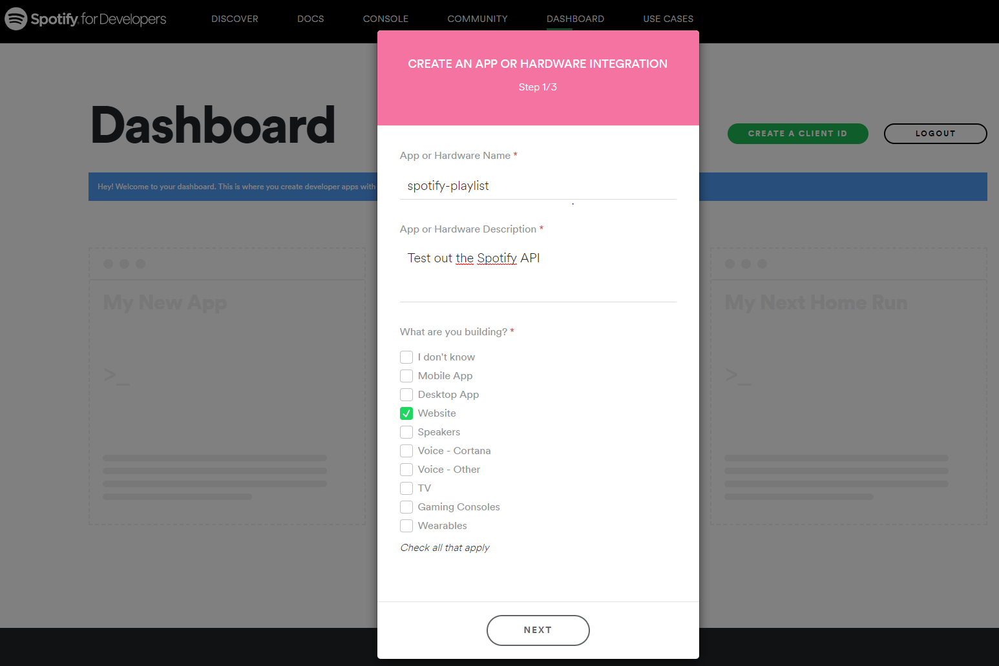
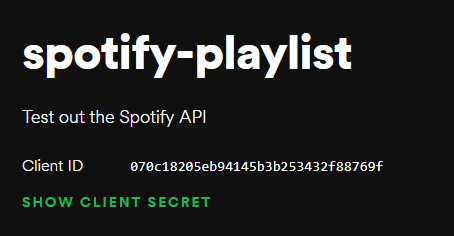
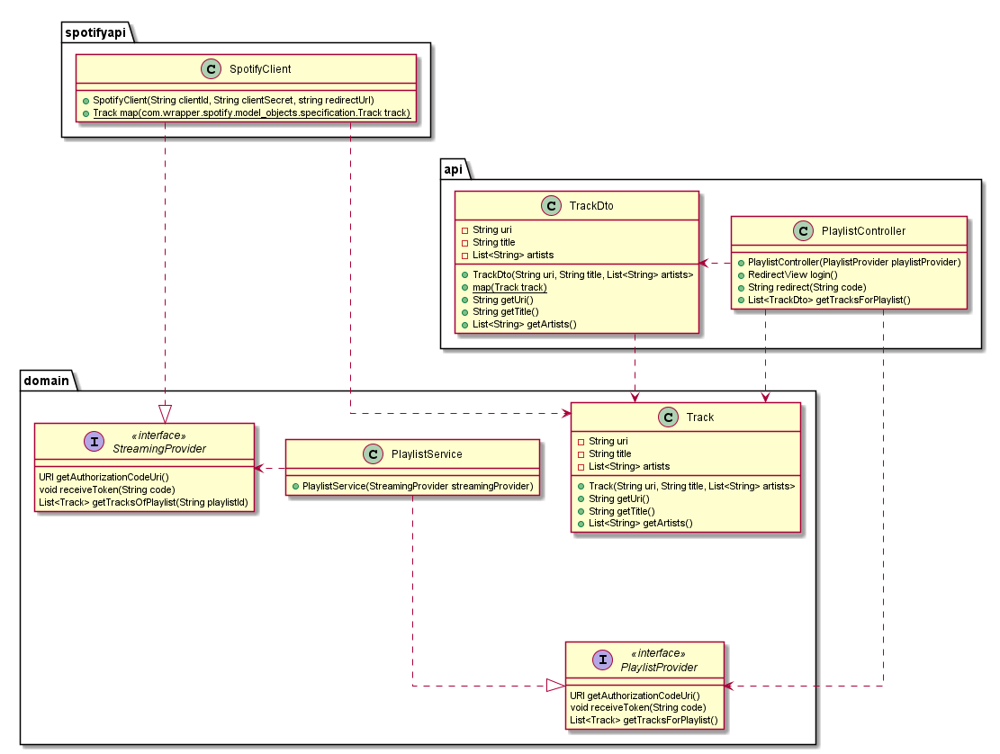
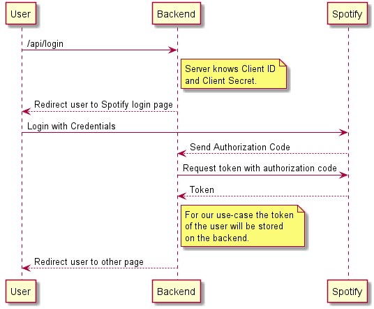
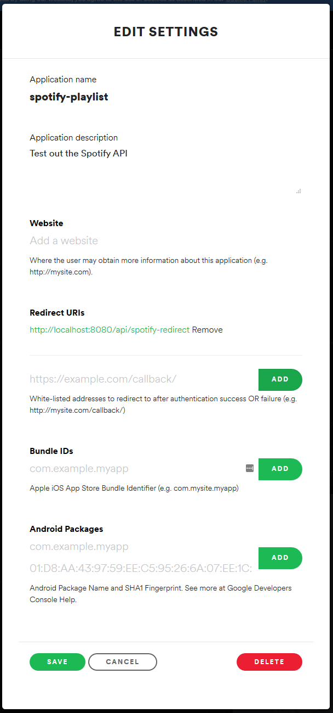

# Use the Spotify API

There are various possibilities to integrate the Spotify API into your own application.
We could either access directly the REST endpoints or use a wrapper API.
In this chapter you will learn how to connect to the Spotify API using a Java wrapper.

## Set up your developer account

Prior to using the Spotify API you have to create a developer account. Navigate to <https://developer.spotify.com/dashboard/> and log in with your account. Create a new app.



Select `No` when asked if you want to develop a commercial integration.
You have to agree to the license agreements in order to use the API.

On the next page you can now look up your Client ID and secret, which are needed for accessing the Spotify API from your application.



In the `application.properties` in the `resources` directory, we are adding the client id and secret as properties.

```properties
spotifyPlaylist.clientId=YOUR CLIENT ID
spotifyPlaylist.clientSecret=YOUR CLIENT SECRET
```

The properties in the application.properties could also be set directly when starting the application by command line arguments.

## Architecture

The following figure shows the classes, we are going to implement.



We can already create the model class `Track` inside the `domain` package.

```java
public class Track {

    private final String uri;
    private final String title;
    private final List<String> artists;

    public Track(String uri, String title, List<String> artists) {
        this.uri = uri;
        this.title = title;
        this.artists = artists;
    }

    /* getters */

}
```

Simultaneously, we can create the `TrackDto` class inside the `api` package.
It looks very similar to the `Track` class, however it also contains a `map` method, which maps a `Track` to a `TrackDto`.

```java
public class TrackDto {

    private final String uri;
    private final String title;
    private final List<String> artists;

    public TrackDto(String uri, String title, List<String> artists) {
        this.uri = uri;
        this.title = title;
        this.artists = artists;
    }

    /* getters */

    public static TrackDto map(Track track) {
        return new TrackDto(track.getUri(), track.getTitle(), track.getArtists());
    }

}
```

We are creating those two very similar classes, because they serve different purposes.
`Track` is used internally as an entity, which will be mapped to from the corresponding classes of the Spotify Web API.
`TrackDto` is used as the DTO, which is sent over the web by the REST controller.

## Login to the Spotify Web API

We are using the Java wrapper API [thelinmichael/spotify-web-api-java](https://github.com/thelinmichael/spotify-web-api-java) for accessing the Web API of Spotify.

Add the dependency to your `build.gradle` file:

```groovy
dependencies {
    // ...
    implementation 'se.michaelthelin.spotify:spotify-web-api-java:2.1.2'
}
```

For accessing the API we have to authenticate the application first.
The image below shows the authentication flow for getting a token on the backend.



When the user opens the `/api/login` endpoint with his browser, the backend should redirect him to the login page of Spotify.
After logging in on the Spotify website it redirects the user back to a defined URL, which can be chosen by the developer.
For this we add another property in the `application.properties` file.

```properties
spotifyPlaylist.redirectUrl=http://localhost:8080/api/spotify-redirect
```

For this application we are making some compromises, which limit the ability of our application to scale.
E.g. we are storing the token on the backend.
The way we are going to implement this, makes the application only usable for editing one user's playlist at a time.

Now we start with the implementation.
We create the interface `StreamingProvider` inside the `domain` package.
This interface will be implemented by a class which connects to the Spotify Web API wrapper.
The goal of this abstraction is, that we could easily replace the access to the Spotify API and use Google Play Music or other streaming providers instead, if we wanted to.

```java
public interface StreamingProvider {

    URI getAuthorizationCodeUri();
    void receiveToken(String code);
    List<Track> getTracksOfPlaylist(String playlistId);

}
```

The next step is to implement this interface with the `SpotifyClient` class inside the `spotifyapi` package.

This class connects to the Spotify Web API through the dependency we added.
You can see that we inject with `@Value` the properties we have set in `application.properties` into the constructor.
In the constructor we instantiate an object of the `SpotifyApi` class.
The `SpotifyApi` class is part of the wrapper library.

The `@Component` annotation before the class definition is needed by Spring Boot and it will allow us to inject instances of this class as a dependency into other classes.

```java
@Component
public class SpotifyClient implements StreamingProvider {

    private final SpotifyApi spotifyApi;

    public SpotifyClient(@Value("${spotifyPlaylist.clientId}") final String clientId,
                             @Value("${spotifyPlaylist.clientSecret}") final String clientSecret,
                             @Value("${spotifyPlaylist.redirectUrl}") final String redirectUrl) {

        URI uri = SpotifyHttpManager.makeUri(redirectUrl);
        spotifyApi = new SpotifyApi.Builder()
                .setClientId(clientId)
                .setClientSecret(clientSecret)
                .setRedirectUri(uri)
                .build();
    }

    public URI getAuthorizationCodeUri() {
        return null;
    }

    public void receiveToken(String code) {
    }

    public List<Track> getTracksOfPlaylist(String playlistId) {
        return Collections.emptyList();
    }

}
```

Now we can start with implementing the methods of the interface.
We implement the method `getAuthorizationCodeUri`, which generates the URI to the Spotify login page.
This URI will contain the client id and redirect URI back to our application as parameters.
The scope tells Spotify, which access rights the user needs to grant the application for using it.

```java
public URI getAuthorizationCodeUri() {
    AuthorizationCodeUriRequest authorizationCodeUriRequest = spotifyApi.authorizationCodeUri()
            .scope("playlist-modify")
            .build();

    return authorizationCodeUriRequest.execute();
}
```

Now we implement another interface `PlaylistProvider` inside the `domain` package.
This interface will be implemented by classes, which are an abstraction between the REST controller and the class which accesses the Spotify Web API.

```java
public interface PlaylistProvider {

    URI getAuthorizationCodeUri();
    void receiveToken(String code);
    List<Track> getTracksForPlaylist();

}
```

As you can see this interface is pretty similar to the `StreamingProvider` interface, however, they serve different purposes.

We implement this interface in the `PlaylistService` class inside the `domain` package, which separates the access to the Spotify API from the business logic of our application.
We inject an object of the `StreamingProvider` interface in the constructor.
Spring Boot recognizes that `SpotifyClient` is an implementation of `StreamingProvider` and will therefore inject an instance of `SpotifyClient`.

```java
@Service
public class PlaylistService implements PlaylistProvider {

    private StreamingProvider streamingProvider;

    @Autowired
    public PlaylistService(StreamingProvider streamingProvider) {
        this.streamingProvider = streamingProvider;
    }

    public URI getAuthorizationCodeUri() {
        return streamingProvider.getAuthorizationCodeUri();
    }

    public void receiveToken(String code) {
    }

    public List<Track> getTracksForPlaylist() {
        return Collections.emptyList();
    }

}
```

The `getAuthorizationCodeUri` method of the `PlaylistService` does nothing else than calling the corresponding method in the `StreamingProvider` implementation.

We create a controller `PlaylistController` inside the `api` package, which will handle all the requests to our backend server.
It has to serve the `/api/login` endpoint, which redirects the user to the Spotify login page.
The URI to which the user is redirected can be received from an implementation of the `PlaylistProvider` interface, which we inject with the constructor.
This endpoint is used so that the user does not need to know the client secret from the Spotify API.

```java
@RestController
@CrossOrigin
@RequestMapping("/api")
public class PlaylistController {

    private PlaylistProvider playlistProvider;

    @Autowired
    public PlaylistController(PlaylistProvider playlistProvider) {
        this.playlistProvider = playlistProvider;
    }

    @GetMapping("/login")
    public RedirectView login() {
        URI uri = playlistProvider.getAuthorizationCodeUri();

        RedirectView redirectView = new RedirectView();
        redirectView.setUrl(uri.toString());
        return redirectView;
    }

    @GetMapping("/spotify-redirect")
    public String redirect(@RequestParam String code) {
        return code;
    }

}
```

If you start the application now and navigate to <http://localhost:8080/api/login> in a browser you will be seeing an error message:

```INVALID_CLIENT: Invalid redirect URI```

This is because we have to whitelist all our redirect URLs on the Spotify API website.
For doing this navigate to <https://developers.spotify.com/dashboard> and click on your application.
Then click on the green `Edit settings` button and add a redirect URL.



If you try to access <http://localhost:8080/api/login> again, you should be redirected to the Spotify login.
Maybe you are going to be asked, if you want to give your application the permission to access your account with it.
After a successful login you should be redirected back to your backend application and should see the authorization code in your browser.

Getting the authorization code is just an intermediate step in getting the token for gaining access to the api.
Therefore we have to implement a new method in `SpotifyClient` to receive a token from a valid auth code.
If we have the token, we can store it directly within the `spotifyApi` instance.
The token is lost when the application is restarted.

```java
public void receiveToken(String code) {
    try {
        AuthorizationCodeRequest authorizationCodeRequest = spotifyApi.authorizationCode(code)
                .build();

        final AuthorizationCodeCredentials authorizationCodeCredentials = authorizationCodeRequest.execute();

        spotifyApi.setAccessToken(authorizationCodeCredentials.getAccessToken());
        spotifyApi.setRefreshToken(authorizationCodeCredentials.getRefreshToken());
    } catch (IOException | SpotifyWebApiException e) {
        System.out.println("Error: " + e.getMessage());
    }
}
```

Now that we have this method, we just have to call it in the `PlaylistService` and `PlaylistController`.

```java
// PlaylistService
public void receiveToken(String code) {
    streamingProvider.receiveToken(code);
}

// PlaylistController
@GetMapping("/spotify-redirect")
public String redirect(@RequestParam String code) {
    playlistProvider.receiveToken(code);
    return code;
}
```

If you restart the application and navigate to [http://localhost:8080/api/login](http://localhost:8080/api/login), the application does the same thing as before.
But under the hood, the token is set in the `SpotifyApi` instance and the api now can be used for accessing playlists and tracks.

## Get all tracks of a playlist from Spotify

First we create the endpoint `/playlists/tracks` for getting the tracks of a playlist in our `PlaylistController`.
We want this endpoint to return a list of tracks.
We can already call the corresponding method of the `PlaylistProvider` implementation, however, we need to map from `Track` to `TrackDto`.

```java
@GetMapping("/playlists/tracks")
public List<TrackDto> getTracksForPlaylist() {
    return playlistProvider.getTracksForPlaylist().stream()
            .map(TrackDto::map)
            .collect(Collectors.toList());
}
```

Spring Boot will automatically translate the returned list of `TrackDto` to a JSON representation when calling the REST endpoint.

We have to call the `getTracksOfPlaylist` method of the `StreamingProvider` implementation in the `PlaylistService`.
For this example we use a hardcoded playlist ID.
Create a new Spotify playlist, add some tracks and copy the ID at the end of the playlist URL.

```java
public List<Track> getTracksForPlaylist() {
    return streamingProvider.getTracksOfPlaylist("YOUR PLAYLIST ID");
}
```

::: tip  EXERCISE
Extract the playlist ID to a property.
:::

In the class `SpotifyClient` we have to implement a method for accessing playlist throught the wrapper API.
You can find examples on how to request playlist tracks from the API on [Github](https://github.com/thelinmichael/spotify-web-api-java/blob/master/examples/data/playlists/GetPlaylistsTracksExample.java).

The Spotify API returns a `Paging` object which is a container for multiple `PlaylistTrack` objects.
If you look at the code of those classes it becomes clear, that we have to map the `Track` from the wrapper library inside the `PlaylistTrack` to our own `Track` entity, because that is the expected return value of the `getTracksOfPlaylist` method.
For doing this, we implement a `map` method inside `SpotifyClient` and map all entities in the `getTracksOfPlaylist` method.

```java
private static Track map(com.wrapper.spotify.model_objects.specification.Track track) {
    return new Track(track.getUri(), track.getName(), Arrays.stream(track.getArtists())
            .map(ArtistSimplified::getName)
            .collect(Collectors.toList()));
}

@Override
public List<Track> getTracksOfPlaylist(String playlistId) {
    GetPlaylistsTracksRequest getPlaylistRequest = spotifyApi.getPlaylistsTracks(playlistId).build();

    try {
        Paging<PlaylistTrack> paging = getPlaylistRequest.execute();
        return Arrays.stream(paging.getItems())
                .map(PlaylistTrack::getTrack)
                .map(SpotifyClient::map)
                .collect(toList());
    } catch (IOException | SpotifyWebApiException e) {
        System.err.println("Error: " + e.getMessage());
    }
    return emptyList();
}
```

Now you can start the application, [login](http://localhost:8080/api/login) and access the [tracks of your playlist](http://localhost:8080/api/playlists/tracks).

::: tip EXERCISE

* The heroku `config` commands makes it easy to manage your app’s config vars.

```bash
heroku config:set spotifyPlaylist.clientId=<CLIENT ID>
heroku config:set spotifyPlaylist.clientSecret=<CLIENT SECRET>
heroku config:set spotifyPlaylist.playlistId=<PLAYLIST ID>
heroku config:set spotifyPlaylist.redirectUrl=https://<APPLICATION NAME>.herokuapp.com/api/spotify-redirect
```

* Push your changes to Heroku and test the application.

:::

::: tip EXERCISE
Create the following endpoint:

    GET /api/tracks?query={queryString}

The request takes a GET parameter `query` which is a String.
The endpoint should search tracks which match the query and return a list of tracks.
Limit the result to 10 entries.
You can have a look at the [example](https://github.com/thelinmichael/spotify-web-api-java/blob/master/examples/data/search/simplified/SearchTracksExample.java) provided by the Java wrapper Github project.

Add the necessary methods to the interfaces.

### Example call

```bash
curl http://localhost:8080/api/tracks?query=aaa
```

### Example result

The call should respond with HTTP status code 200.

```json
[
  {
    "uri": "spotify:track:4TI9XHuNZMQWNSN77inA3b",
    "title": "Genesis (Live / AAA)",
    "artists": [
      "Justice"
    ]
  },
  // ...
]
```

:::

::: tip EXERCISE

Create a new endpoint, which allows the insertion of multiple tracks to the playlist.

    POST /api/playlists/tracks

In the body of the request the endpoint expects a list of strings, which represent the track URIs.

Add the necessary methods to the interfaces.

### Example call

```json
curl --header "Content-Type: application/json" \
    --request POST \
    --data '["spotify:track:4TI9XHuNZMQWNSN77inA3b", "spotify:track:6dX3nqfZpmktmO26eWdYw4"]' \
    http://localhost:8080/api/playlists/tracks
```

### Example result

The call should respond with HTTP status code 200 and the tracks are added to the playlist.

:::
