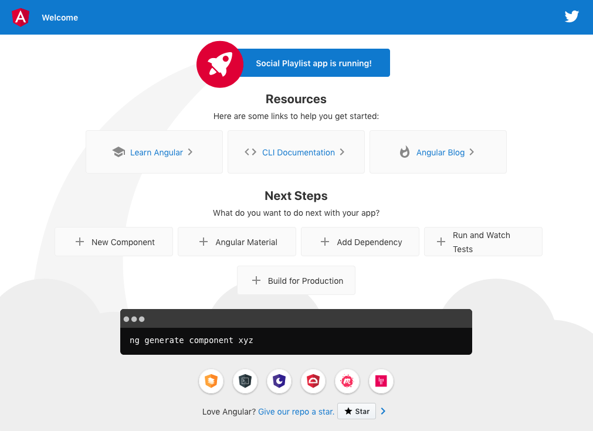

# First Angular Application

This section shows you how to build and run a simple Angular app^[<https://angular.io/guide/quickstart>] and the integration in Spring Boot.

## Install the Angular CLI

We use the Angular CLI to create projects and ongoing development tasks (Angular 8).

```bash
npm install -g @angular/cli
```

## Create a workspace and initial application

Open a console terminal in the root of your project and create a new workspace and initial app project.

```bash
ng new ui
? Would you like to add Angular routing? No
? Which stylesheet format would you like to use? CSS
```

## Serve the application

Angular includes a server, so that you can easily build and serve your app locally.

1. Go to the workspace folder:

    ```bash
    cd ui
    ```

2. Launch the server by using the CLI command `ng serve` with the `--open` option.

    ```bash
    ng serve --open
    ```

  The `--open` option automatically opens your browser to <http://localhost:4200>.


## Edit your first Angular component

Components are the fundamental building blocks of Angular applications. They display data on the screen, listen for user input, and take action based on that input.

As part of the initial app, the CLI created the first Angular component for you. It is the root component, and it is named app-root.

1. Open `app.component.spec.ts`.

2. Change the application title from `'ui'` to `'Social Playlist'`.

    ```typescript{4,11}
     it(`should have as title 'Social Playlist'`, () => {
        const fixture = TestBed.createComponent(AppComponent);
        const app = fixture.debugElement.componentInstance;
        expect(app.title).toEqual('Social Playlist');
      });
    
      it('should render title', () => {
        const fixture = TestBed.createComponent(AppComponent);
        fixture.detectChanges();
        const compiled = fixture.debugElement.nativeElement;
        expect(compiled.querySelector('.content span').textContent).toContain('Social Playlist app is running!');
      });
    ```

3. Run tests.

    ```bash
    ng test
    ```

4. Open `./src/app/app.component.ts`.

5. Change the `title` property from `'ui'` to `'Social Playlist'`.

    ```typescript{7}
    @Component({
      selector: 'app-root',
      templateUrl: './app.component.html',
      styleUrls: ['./app.component.css']
    })
    export class AppComponent {
      title = 'Social Playlist';
    }
    ```

6. Run tests.

    ```bash
    ng test
    ```

The browser reloads automatically with the revised title.



## Deploy the frontend together with the backend

For the Angular part we want to create a jar with a static directory that contains the result of our Angular build.
By doing this we can include the jar in our backend module. And because Spring Boot will automatically add static web.
resources located within static, the Angular application will be visible when we launch the application^[<https://ordina-jworks.github.io/architecture/2018/10/12/spring-boot-angular-gradle.html>].

1. Create a `build.gradle` file in the `ui` project.

    ```groovy
    plugins {
      id 'java'
      id 'com.moowork.node' version '1.2.0'
    }

    node {
      version = '10.16.0'
      npmVersion = '6.4.1'
      download = true
    }

    jar.dependsOn 'npm_run_build'
   
    sourceCompatibility = '1.8'

    jar {
      from 'dist/ui' into 'static'
    }
    ```

2. We have to include the `ui` project in the `settings.gradle`.

    ```groovy
    include 'ui'
    ```

3. Our Spring Boot project already has a `build.gradle` file generated. We just have to add our dependencies to include the `ui` module.

    ```groovy{3}
    dependencies {
        ...
        implementation(project(':ui'))
    }
    ```

::: tip EXERCISE

* Push your changes to Heroku and test the application.

:::
